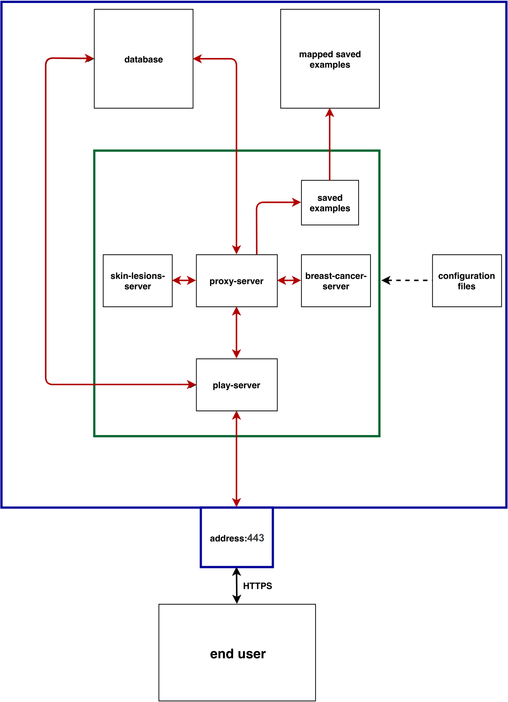
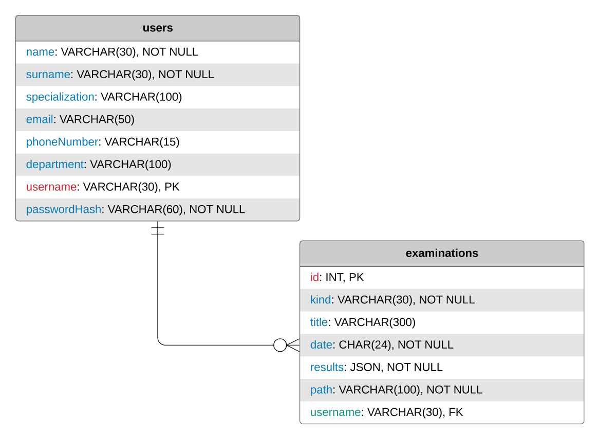
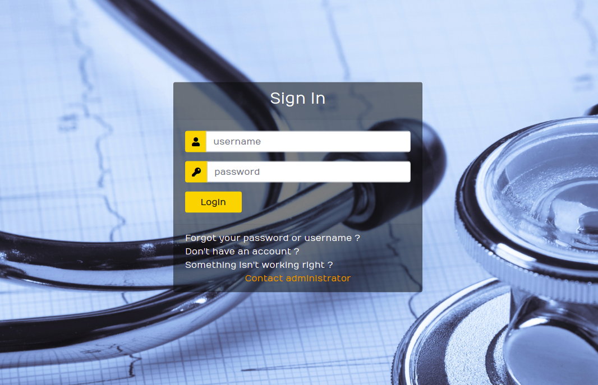
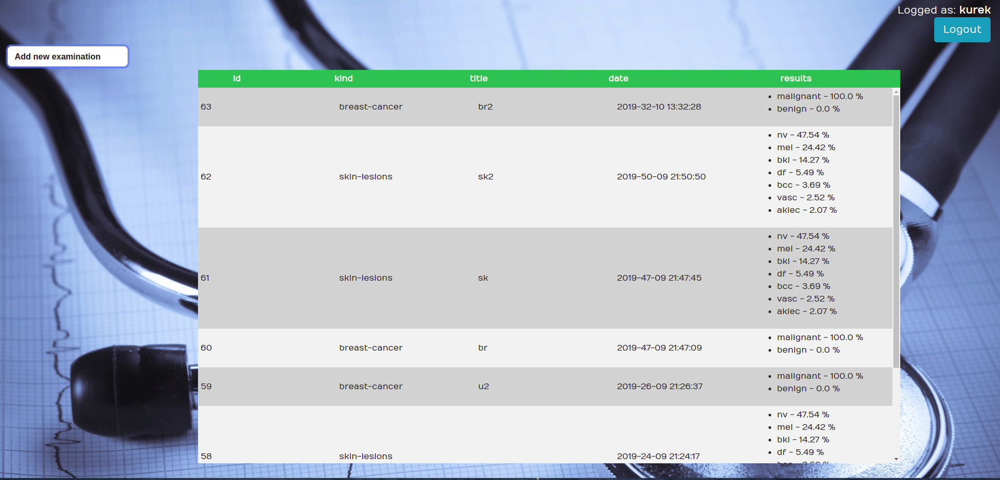
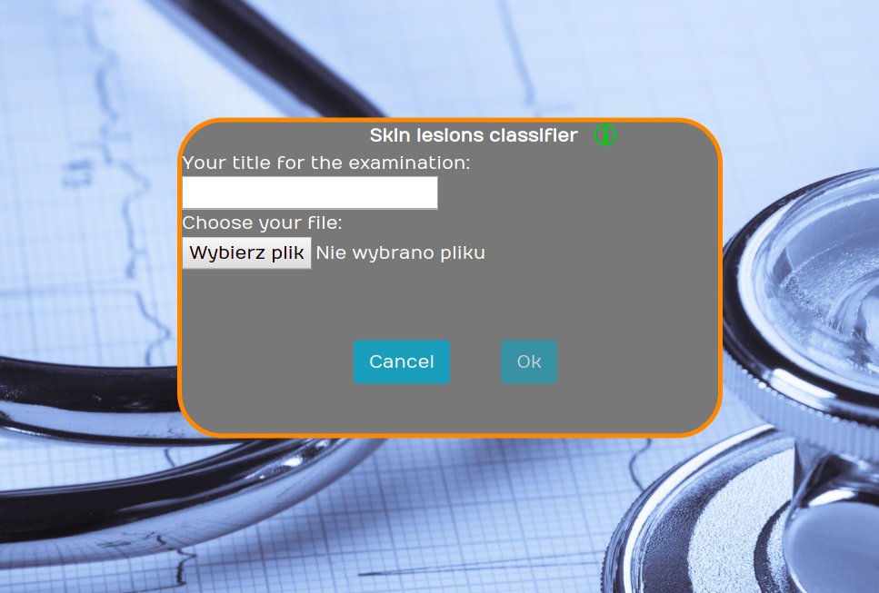

**Master's thesis**: "Multimodal machine learning system for medical application"

The main goal of the master's thesis was to design and build a system which could support doctors in diagnosing diseases.
The system consists of several parts in different repositories:
- main server written using Scala, Play Framework, Slick, HTML, CSS, jQuery (current repository)
- additional services such as: proxy-server, custom scikit server (breast-cancer-server), tensorflow/serving (skin-lesions-server), BCrypt hashing 
written using Python, Flask, SQLAlchemy, Scala
(https://github.com/imarkiew/Multimodal-ML-System-Services)
- models: skin lesion classification with the usage of keras & tensorflow, breast cancer classification with usage of scikit & xgboost (https://github.com/imarkiew/Multimodal-ML-System-Models)

Most services are used together with Docker and Docker Compose. MySQL 8.x was used as database.

The green color is Docker Compose and the blue is instance that serves the system (Google Cloud Engine was used)

